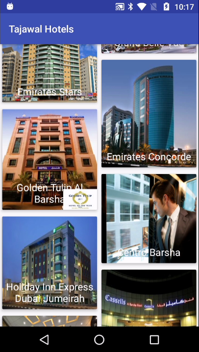
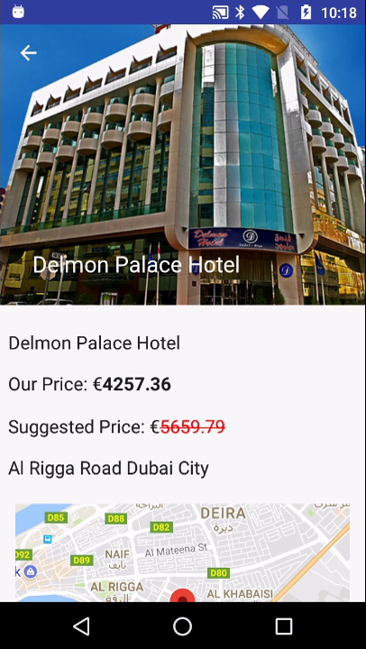
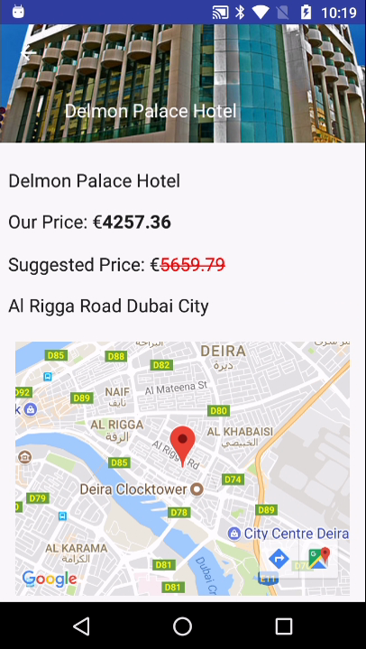

# Tajawal Hotels

Amostra de projeto Android pronta para portfólio, com foco em separação clara de responsabilidades, decisões de engenharia pragmáticas e uma implementação clássica em MVP que continua fácil de explicar em entrevistas e processos seletivos.

O aplicativo apresenta uma experiência enxuta de navegação por hotéis: o usuário pode carregar uma lista de hotéis, abrir uma tela de detalhes com preço e localização e visualizar a imagem principal em uma tela dedicada. A base preserva intencionalmente o estilo arquitetural original em vez de ser adaptada à força para um padrão mais novo, o que a torna um bom exemplo de atuação eficiente em um código Android já existente sem recorrer a reescritas desnecessárias.

## Por Que Este Projeto Vale a Análise

Este repositório é um bom ponto de conversa para recrutadores, líderes técnicos e empresas porque demonstra:

- telas orientadas por contratos em MVP
- camada de Repository coordenando acesso remoto e local aos dados
- injeção de dependência com Dagger 2 em um fluxo real de aplicação
- processamento assíncrono com RxJava
- cache leve para acelerar acessos repetidos
- testes unitários focados em presenters
- oportunidades de modernização tratadas com critério, sem churn arquitetural

## Objetivo do Aplicativo

O escopo do produto é intencionalmente compacto, mas realista o suficiente para evidenciar fundamentos de engenharia:

- buscar dados de hotéis em um endpoint remoto
- armazenar localmente a lista mais recente de hotéis
- renderizar uma lista navegável de hotéis
- exibir detalhes do hotel, preço, endereço, imagem e localização no mapa
- abrir a imagem do hotel em um visualizador em tela cheia

Esse conjunto menor de funcionalidades ajuda a arquitetura a permanecer visível. Quem avalia o projeto consegue entender rapidamente onde mora a lógica de UI, de onde vêm os dados, como as dependências são conectadas e como a aplicação pode evoluir ao longo do tempo.

## Stack

### Core

- Kotlin 1.4.10
- Android Gradle Plugin 4.1.0
- Aplicação Android com módulo único
- `minSdkVersion 19`
- `targetSdkVersion 27`
- Android Support Libraries (pré-AndroidX)

### Arquitetura e Infraestrutura

- MVP (Model-View-Presenter)
- Repository pattern
- Dagger 2
- Retrofit 2
- Gson
- OkHttp + logging interceptor
- RxJava 2 + RxAndroid 2
- PaperDB para persistência local leve
- Glide para carregamento de imagens
- Google Maps SDK

### Testes

- JUnit 4
- Mockito
- Mockito Kotlin
- Estrutura inicial de testes instrumentados Android com Espresso

## Arquitetura

Os diagramas de arquitetura agora ficam em [`docs/architecture/README.md`](docs/architecture/README.md), mantendo a documentação visual perto do código em um formato textual simples de revisar e atualizar.

### MVP + Repository

A aplicação segue uma abordagem clássica de MVP em Android:

- classes `Activity` atuam como Views
- interfaces `Contract` definem as responsabilidades entre View e Presenter
- classes `Presenter` coordenam o comportamento das telas e as decisões de UI
- `HotelsRepository` abstrai a recuperação de dados e os detalhes de persistência local da camada de apresentação

Essa estrutura mantém as preocupações do framework Android concentradas na View, enquanto a orquestração fica nos presenters e o acesso a dados permanece dentro da pilha de repository/provider.

### Fluxo de Dados

O fluxo da listagem é simples e explícito:

1. `HotelListPresenter` solicita os dados de hotéis ao `HotelsRepository`.
2. O repository chama a API remota por meio do Retrofit.
3. Em caso de sucesso, a resposta é persistida localmente via `HotelProvider`, usando PaperDB.
4. O repository emite o primeiro resultado não vazio disponível.
5. O presenter atualiza a View com estados de carregamento, sucesso e erro.

O fluxo de detalhes é intencionalmente orientado a cache. Depois que a lista é carregada, a tela de detalhes resolve o hotel selecionado localmente por ID, sem disparar uma nova chamada de endpoint.

### Injeção de Dependência

O Dagger 2 é usado para conectar a aplicação por meio de:

- `AppComponent` para dependências de escopo global
- `ActivityBuilder` para injeção nas activities
- módulos dedicados para settings, rede, repository, provider e contratos por tela

É uma configuração tradicional, mas mantém a construção de objetos explícita e facilita bastante os testes de presenter.

### Diagramas de Arquitetura

O repositório agora inclui diagramas Mermaid simples para:

- arquitetura em camadas
- fluxo ponta a ponta no MVP
- cobertura de testes focada nos presenters

Com isso, os diagramas continuam fáceis de manter em pull requests, sem depender de imagens binárias ou ferramentas externas.

## Estrutura de Pacotes

```text
TajawalProgrammingTest/
├── app/
│   ├── src/main/java/com/renatoramos/tajawal/
│   │   ├── common/
│   │   │   ├── constants/
│   │   │   ├── di/
│   │   │   ├── extensions/
│   │   │   └── ui/
│   │   ├── data/
│   │   │   ├── model/
│   │   │   └── store/
│   │   │       ├── local/
│   │   │       └── remote/
│   │   ├── presentation/
│   │   │   ├── base/
│   │   │   └── ui/hotel/
│   │   │       ├── list/
│   │   │       ├── detail/
│   │   │       └── imageviewer/
│   │   └── MainApplication.kt
│   ├── src/test/
│   └── src/androidTest/
└── design/
```

### Responsabilidades dos Pacotes

- `common`: infraestrutura compartilhada da aplicação, como DI, constantes, extensões, escopos e utilitários de UI reutilizáveis
- `data`: modelos, repository, provider local e definições de serviços remotos
- `presentation`: contratos-base de MVP, além de presenters, activities, adapters e módulos específicos de cada tela

## Telas Incluídas

### Lista de Hotéis

A tela inicial exibe os hotéis disponíveis em um layout rolável e delega todo o comportamento de carregamento ao `HotelListPresenter`.

### Detalhes do Hotel

A tela de detalhes renderiza:

- nome do hotel
- preço promocional e preço original
- endereço
- imagem principal
- marcador no mapa usando latitude e longitude

### Visualizador de Imagem em Tela Cheia

O visualizador de imagem adiciona um fluxo focado em detalhe visual e completa o app com uma interação pequena, mas bem acabada.

## Estratégia de Testes

A estratégia atual de testes concentra-se no comportamento dos presenters, o que conversa bem com a arquitetura, já que eles concentram a lógica de orquestração.

Os testes cobertos incluem:

- `HotelListPresenterTest`
- `DetailsPresenterTest`
- `ImageViewerPresenterTest`

Esses testes validam preocupações como:

- chamadas de setup da tela durante o `onStart`
- interação com o repository
- renderização de sucesso
- propagação de erro
- gatilhos de navegação e abertura de imagem

Esse é um trade-off sensato para uma base em MVP: boa parte do comportamento de UI relevante para o negócio pode ser validada sem inicializar componentes do framework Android.

## Screenshots

As screenshots estão na pasta [`design/`](design).

| Lista de hotéis | Lista de hotéis |
| --- | --- |
|  |  |

| Detalhes do hotel | Detalhes do hotel |
| --- | --- |
|  |  |

| Visualizador de imagem |
| --- |
|  |

## Build e Execução

### Requisitos

- Android Studio
- Android SDK 27
- JDK compatível com Gradle e AGP 4.1.0

### Setup Local

```bash
cd TajawalProgrammingTest
./gradlew assembleDebug
```

Depois, basta executar a configuração `app` pelo Android Studio em um emulador ou dispositivo físico.

## Trade-offs

Este projeto é apresentado intencionalmente como uma amostra bem estruturada de Android legado, e não como um template moderno reescrito.

### Pontos Fortes

- Separação clara entre lógica de view, orquestração e acesso a dados
- Contratos de presenter fáceis de acompanhar
- A abstração de repository esconde a origem dos dados da UI
- Grafo de dependências explícito
- Persistência leve melhora fluxos de navegação repetidos
- Arquitetura fácil de discutir em code reviews, entrevistas e avaliações técnicas

### Trade-offs

- Usa Android Support Libraries em vez de AndroidX
- Usa Kotlin Android synthetics em vez de View Binding
- Mantém tudo em um único módulo, então os limites são organizacionais e não impostos pelo build
- Depende de RxJava 2 em vez de coroutines e Flow
- A estratégia de cache é intencionalmente simples e não tenta sincronização offline completa
- MVP adiciona interfaces e boilerplate em comparação com padrões de UI mais recentes

## Notas de Modernização

O objetivo deste repositório não é migrar a arquitetura. Se esta base evoluísse hoje, o caminho mais responsável seria uma modernização incremental, preservando MVP + Repository:

1. Migrar de Support Libraries para AndroidX.
2. Atualizar Gradle, Kotlin e versões das bibliotecas.
3. Substituir Kotlin synthetics por View Binding.
4. Refinar o tratamento de estado de UI para carregamento, sucesso e erro.
5. Fortalecer a semântica do repository em relação a fallback de cache e cenários de falha.
6. Adicionar testes no nível de repository e alguns testes de UI/instrumentação de maior valor.
7. Considerar modularização apenas se o escopo crescer o suficiente para justificar isso.

O ponto principal aqui é a disciplina arquitetural: o projeto permanece intencionalmente em MVP para demonstrar manutenção e melhoria de um padrão existente, e não uma reescrita desnecessária.

## Notas Para Recrutadores

Este repositório funciona melhor como evidência de:

- conforto ao trabalhar em arquiteturas Android já estabelecidas
- capacidade de manter responsabilidades separadas e testáveis
- experiência com injeção de dependência, cache, rede e fluxos reativos
- maturidade para modernizar uma base progressivamente em vez de recorrer a grandes migrações como padrão

## Licença

Licenciado sob a licença MIT. Consulte [LICENSE](LICENSE).
