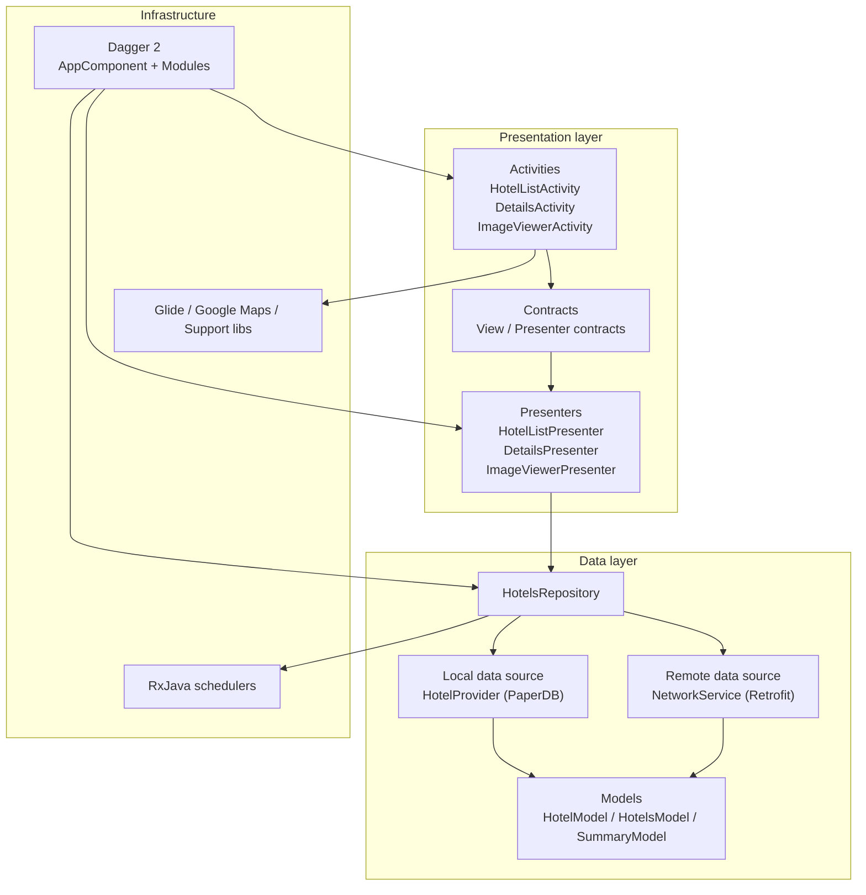
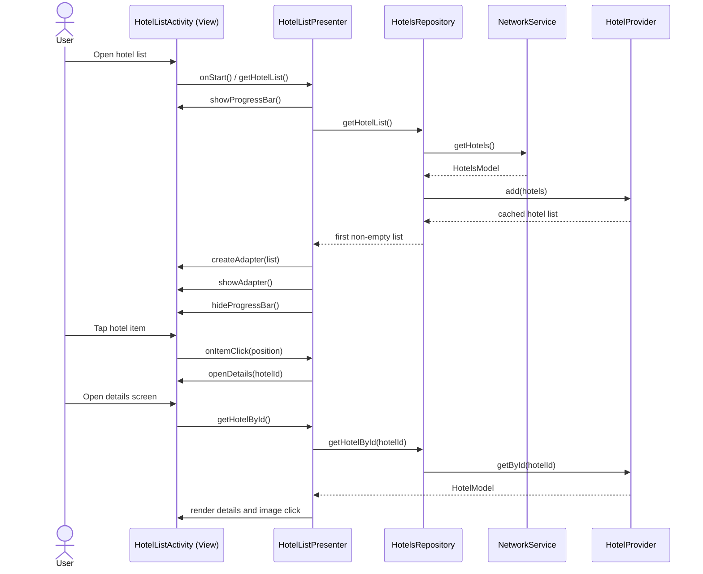
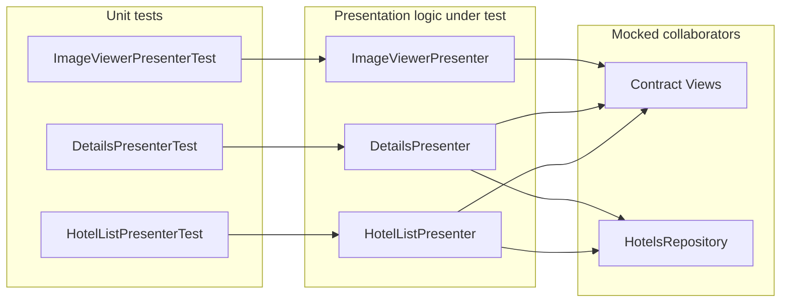

# Architecture Diagrams

This folder keeps the repository architecture documentation close to the code and easy to evolve in pull requests.

## Why Mermaid

- GitHub renders Mermaid blocks natively in Markdown
- diagrams stay versioned as text
- updates are simple when packages, flows, or tests change

## Recommended Structure

- `docs/architecture/README.md`: central index for high-level diagrams
- optional future files in the same folder for sequence diagrams or feature-specific flows

## Layered View

## Main MVP Data Flow

## Test Coverage View

## Notes For Future Updates

- keep package names aligned with the diagrams when screens or modules change
- update the data flow whenever the repository strategy changes
- extend the testing diagram if repository or instrumentation coverage grows
